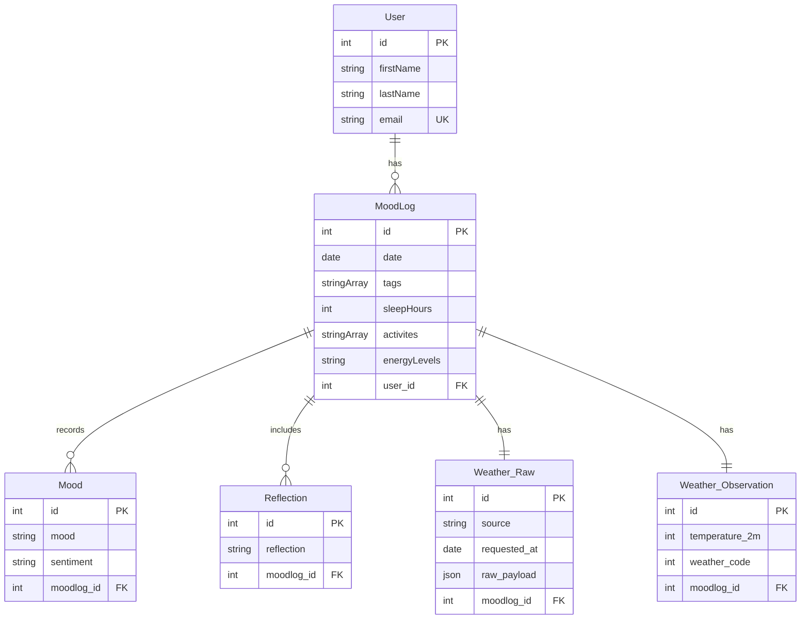

# Mood Tracking API

A containerized FastAPI backend with a PostgreSQL database, deployed on AWS EC2 using Docker Compose.

## Tech Stack

- FastAPI
- PostgreSQL
- Docker
- AWS EC2

## Notion Road Map 

Learning Roadmap: https://catnip-single-f71.notion.site/Mood-Tracker-App-Learning-Road-Map-31305a6c00f1800ea3baf797fd9b697f?source=copy_link

## Database Schema



## Test Weather ETL

Start the database:

```bash
docker compose up -d db
```

Run the API locally:

```bash
uvicorn app.main:app --reload --host 0.0.0.0 --port 8000
```

Create a user:

```bash
curl -X POST http://localhost:8000/users/ \
  -H "Content-Type: application/json" \
  -d '{"firstName":"Jamie","lastName":"Lee","email":"jamie@example.com"}'
```

Create a mood log:

```bash
curl -X POST http://localhost:8000/moodlogs/ \
  -H "Content-Type: application/json" \
  -d '{
    "date": "2026-04-03",
    "sleepHours": 7,
    "energyLevels": "steady",
    "activities": ["reading", "stretching"],
    "tags": ["focused", "outdoors"],
    "user_id": 1
  }'
```

Check the saved weather:

```bash
docker compose exec -T db psql -U postgres -d moodtracker -c "SELECT * FROM weather_observation ORDER BY id DESC LIMIT 1;"
```
